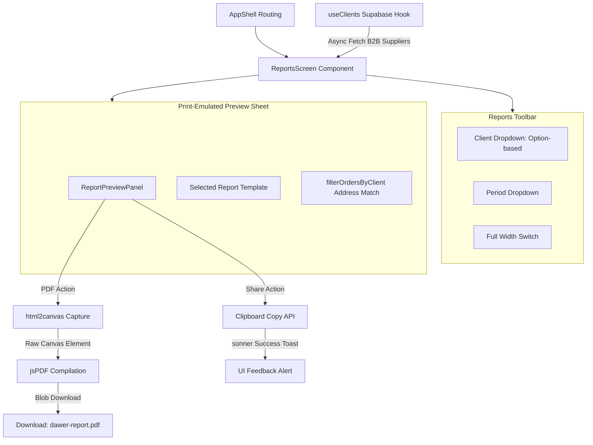

# Dawer Phase 2 Reports — Technical Specification & Implementation Guide

> **Document Version**: 1.0  
> **Target View**: Reports View (`/reports` -> `ReportsScreen.tsx`)  
> **Key Enhancements**: Client-side high-fidelity PDF export, B2B client dynamic filtering, shareable url copying  
> **Design Framework**: Antigravity UI & Motion (glassmorphism, spring transitions, GPU-accelerated dialog overlays)  
> **Code Patterns**: FP-TS React (`Option` client filtering, `RemoteData` state matching, disabled action states)

---

## 1. Architectural Flow & mermaid Diagram

The Phase 2 Reports architecture maps the flow of server-cached B2B client list data down through the template preview rendering layer and exposes high-fidelity browser canvas compilation to save reports as local PDFs.



---

## 2. Dependency Updates

We will introduce client-side canvas capturing and document compilation. These libraries are lightweight, package-compliant, and fully compatible with React 18:

```json
// package.json additions
"dependencies": {
  "jspdf": "^2.5.2",
  "html2canvas": "^1.4.1"
}
```

---

## 3. Dynamic B2B Client Filter & FP-TS State

To align with modern type-safe standards (`fp-ts-react` patterns), we will represent the client selection state using `Option` wrappers. This makes "no selected client" (representing the overall Amman operations brief) separate from "a selected client filter" (representing a specific restaurant or hotel's ESG stats).

### A. State Interface
Instead of relying on nullable primitives, the Reports Screen wraps selected values:
```typescript
import * as O from "fp-ts/Option";
import { useState } from "react";
import { Client } from "../../types";

// State holds Option<string> containing the selected B2B client profile ID
const [selectedClient, setSelectedClient] = useState<O.Option<string>>(O.none);
```

### B. Fetching B2B Clients with RemoteData
We map the Supabase data query status (`isLoading`, `isError`, `data`) into a clean state machine helper:
```typescript
import { useClients } from "../../../hooks/useClients";

const { data: clients = [], isLoading, isError } = useClients();

// Render selector dropdown safely:
{isLoading ? (
  <div className="h-8 w-32 bg-neutral-100 animate-pulse rounded-md" />
) : isError ? (
  <div className="text-xs text-danger-600 font-semibold">Failed to load clients</div>
) : (
  <select
    value={pipe(selectedClient, O.getOrElse(() => ""))}
    onChange={(e) => {
      const val = e.target.value;
      setSelectedClient(val === "" ? O.none : O.some(val));
    }}
    className="rounded-lg border border-border px-3 py-1.5 text-xs bg-white focus-visible:outline-accent-coral"
  >
    <option value="">All B2B Clients</option>
    {clients.map((c) => (
      <option key={c.id} value={c.id}>{c.name}</option>
    ))}
  </select>
)}
```

---

## 4. High-Fidelity PDF Export Utility

We will implement a custom client-side compiler utility. This compiles any HTML element (with print-emulated stylesheets) into a vector PDF without server round-trips.

Create a utility script: `src/app/lib/pdfExport.ts`

```typescript
import html2canvas from "html2canvas";
import { jsPDF } from "jspdf";

interface ExportOptions {
  filename: string;
  onStart?: () => void;
  onProgress?: (progress: number) => void;
  onComplete?: () => void;
  onError?: (err: Error) => void;
}

export async function exportElementToPdf(elementId: string, options: ExportOptions) {
  const element = document.getElementById(elementId);
  if (!element) {
    options.onError?.(new Error(`Element with id "${elementId}" not found.`));
    return;
  }

  try {
    options.onStart?.();

    // Emulate print CSS style modifications temporarily
    element.classList.add("print-pdf-capture");

    // Capture DOM layout as high-res canvas (devicePixelRatio improves text rendering)
    const canvas = await html2canvas(element, {
      scale: 2, 
      useCORS: true,
      logging: false,
      backgroundColor: "#ffffff",
      windowWidth: 1024, // Fix width to establish consistent layout break rules
    });

    element.classList.remove("print-pdf-capture");
    options.onProgress?.(50);

    const imgData = canvas.toDataURL("image/png");
    
    // Page dimensions calculation (A4 sheet ratio)
    const imgWidth = 210; // A4 standard width in mm
    const pageHeight = 295; // A4 standard height in mm
    const imgHeight = (canvas.height * imgWidth) / canvas.width;
    let heightLeft = imgHeight;

    const doc = new jsPDF("p", "mm", "a4");
    let position = 0;

    options.onProgress?.(80);

    // Multi-page stitching loop
    doc.addImage(imgData, "PNG", 0, position, imgWidth, imgHeight, undefined, "FAST");
    heightLeft -= pageHeight;

    while (heightLeft >= 0) {
      position = heightLeft - imgHeight;
      doc.addPage();
      doc.addImage(imgData, "PNG", 0, position, imgWidth, imgHeight, undefined, "FAST");
      heightLeft -= pageHeight;
    }

    // Trigger local save dialog
    doc.save(options.filename);
    
    // Memory cleanup
    canvas.width = 0;
    canvas.height = 0;
    
    options.onComplete?.();
  } catch (err) {
    options.onError?.(err instanceof Error ? err : new Error(String(err)));
  }
}
```

---

## 5. UI & Component Integration

### A. ReportPreviewPanel Action Wiring
We will update `ReportPreviewPanel.tsx` to handle compilation states with a disabled export button and loader spinner:

```typescript
import { useState } from "react";
import { exportElementToPdf } from "../../lib/pdfExport";
import * as O from "fp-ts/Option";

// In component:
const [isCompiling, setIsCompiling] = useState(false);

const handleDownloadPdf = async () => {
  const dateStr = new Date().toISOString().slice(0, 10);
  const filename = `dawer-${reportId}-${dateStr}.pdf`;
  
  await exportElementToPdf("report-print-area", {
    filename,
    onStart: () => {
      setIsCompiling(true);
      toast.info("Preparing PDF document...", { description: "Compiling canvas layout" });
    },
    onProgress: (p) => {
      // Optional progress hook
    },
    onComplete: () => {
      setIsCompiling(false);
      toast.success("PDF Downloaded successfully!");
    },
    onError: (err) => {
      setIsCompiling(false);
      toast.error("Failed to export PDF", { description: err.message });
    }
  });
};
```

Update the Download Button component in the toolbar to disable clicks and render a loading spinner:
```tsx
<button
  disabled={isCompiling}
  onClick={handleDownloadPdf}
  className="flex items-center gap-2 bg-brand-600 disabled:bg-brand-400 text-white rounded-lg px-4 py-2 text-xs font-semibold cursor-pointer"
>
  {isCompiling ? (
    <div className="w-3.5 h-3.5 border-2 border-white border-t-transparent rounded-full animate-spin" />
  ) : (
    <Download size={13} />
  )}
  {isCompiling ? "Compiling..." : "Download PDF"}
</button>
```

### B. Shareable URL Generation & Clipboard Copy
Clicking the "Share" button compiles the filter parameters into a URL and copies it to the user's clipboard:

```typescript
const handleShare = () => {
  const clientParam = pipe(
    selectedClient,
    O.match(
      () => "all",
      (id) => id
    )
  );
  
  const shareUrl = `${window.location.origin}/share/report/${reportId}?client=${clientParam}&period=${selectedPeriod}`;
  
  navigator.clipboard.writeText(shareUrl)
    .then(() => {
      toast.success("Share link copied to clipboard!", {
        description: `Link configured for B2B Client: ${clientParam}`
      });
    })
    .catch(() => {
      toast.error("Could not copy link to clipboard.");
    });
};
```

---

## 6. Antigravity UI & Micro-interactions

Following the **Antigravity Vibe** and motion principles, Phase 2 features include premium visual indicators:

### A. Glassmorphic Export Overlay
During PDF compilation (which takes 1-2 seconds), instead of a standard blocking spinner, we render a blurred spatial overlay:

```tsx
{isCompiling && (
  <div 
    className="fixed inset-0 z-[1000] flex items-center justify-center bg-black/10 backdrop-blur-md animate-fade-in"
    style={{ transition: "backdrop-filter 0.3s ease-out" }}
  >
    <div className="bg-white/80 border border-white/40 shadow-glass rounded-2xl p-6 flex flex-col items-center max-w-sm">
      <div className="w-8 h-8 border-3 border-accent-coral border-t-transparent rounded-full animate-spin mb-4" />
      <h4 className="text-sm font-bold text-neutral-800">Generating Document</h4>
      <p className="text-xs text-neutral-400 mt-1 text-center">
        Assembling charts and compiling vector layouts for high-resolution output...
      </p>
    </div>
  </div>
)}
```

### B. Hover Scale Animations on Templates
Report cards in the left gallery list have a weightless hover lift:
```css
.report-template-card {
  transition: transform 0.2s cubic-bezier(0.16, 1, 0.3, 1), box-shadow 0.2s ease-out;
}
.report-template-card:hover {
  transform: translateY(-2px);
  box-shadow: var(--shadow-card-hover);
}
```

---

## 7. Verification & Hard Gates

1. **Verify NPM Build succeeds** immediately after installing `jspdf` and `html2canvas`.
2. **Verify PDF Dimensions**: Ensure standard A4 page layout rules don't crop charts in the middle (use CSS class `.print-pdf-capture` to enforce `page-break-inside: avoid` on Recharts boxes and district tables).
3. **Verify null-safety**: Test with both `O.none` and `O.some("fakhreddine")` selected B2B clients. Ensure the charts and values filter correctly without throwing undefined reference errors.
