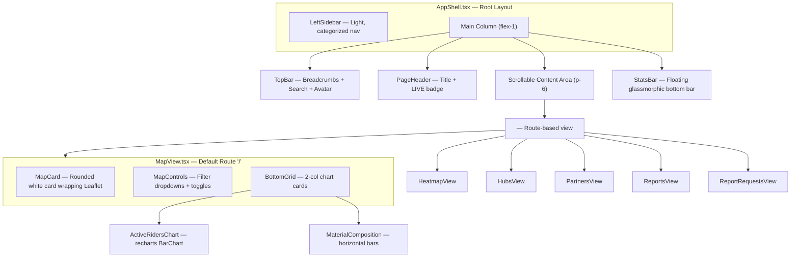

# Dawer Dashboard Redesign — Audited Technical Specification

> **Document Version**: 2.0 (Audited)
> **Audit Date**: 2026-06-29
> **Audit Methodology**: Ultra-granular context-building (audit-context-building), first-principles analysis, cross-file dependency tracing
> **Design Framework**: Antigravity Design Expert (weightless cards, glassmorphism, spatial depth, staggered animations)

---

## 0. Audit Summary & Critical Findings

Before executing any redesign, the following architectural facts were verified line-by-line:

### Current Architecture State

| Concern | Current Implementation | File | Finding |
| :--- | :--- | :--- | :--- |
| **Routing** | `react-router` with `<Outlet>` | `main.tsx:24-37` | Already URL-based. No `useState<ViewId>` for routing — previous doc was incorrect. |
| **State Management** | 3 Zustand stores (`fleetStore`, `hubStore`, `heatmapStore`) + 1 animation store | `src/stores/*` | Stores use single-selector pattern correctly. No prop drilling observed. |
| **Data Fetching** | TanStack Query hooks (`useRiders`, `useHubs`) with `staleTime: 30_000` | `main.tsx:15-22`, `src/hooks/*` | 30s stale time is appropriate for dashboard. `refetchOnWindowFocus: true` ensures fresh data on tab switch. |
| **Map Tiles** | Already uses **CartoDB Positron** (`light_all`) | `LiveMapLayer.tsx:42` | Previous doc proposed switching from Dark Matter — **already done**. No change needed. |
| **Error Handling** | Full error boundary in `AppShell.tsx:88-118` with retry | `AppShell.tsx` | Error screen exists but lacks `sonner` toast integration for partial failures. |
| **Loading States** | Full-page spinner during initial Supabase connection | `AppShell.tsx:121-129` | Violates Golden Rule — should show skeleton layout, not a blank spinner. |
| **Empty States** | `RiderPanel.tsx:122-126` has empty filter message | `RiderPanel.tsx` | Only the rider panel has an empty state. Other views (Hubs, Partners) need them. |
| **CSS Architecture** | Dual-layer: `theme.css` (design tokens) + `globals.css` (animations/utilities) | `src/styles/*` | Well-structured. `@theme inline` block maps all tokens to Tailwind. |
| **Sidebar** | Dark green gradient (`#06402B → #0A5E3E`), 200px fixed width | `LeftSidebar.tsx:7` | Inline styles with raw hex values — violates Guidelines.md "no custom hex" rule. |
| **Accessibility** | `aria-label` on fleet radar button, `aria-pressed` state, `role="region"` on StatsBar | Various | Partial. Missing `aria-expanded` on sidebar items, missing skip-nav link, missing `role="navigation"` on sidebar. |

### Corrections to Previous Redesign Doc

> [!WARNING]
> The previous version of this document contained these inaccuracies:
> 1. **"Replaces `useState<ViewId>`"** — Routing already uses `react-router`. The `ViewId` type is only used for sidebar highlight derivation from `location.pathname` (`AppShell.tsx:36`), not for navigation state.
> 2. **"Switch tiles to CartoDB Positron"** — `LiveMapLayer.tsx:42` already uses `light_all`. No tile change needed.
> 3. **Missing dependency: `recharts`** — Not currently installed. Must be added via `npm install recharts`.

---

## 1. Libraries & Dependency Blueprint

### Already Installed (Verified in `package.json`)

| Library | Version | Used For |
| :--- | :--- | :--- |
| `react-router` | ^7.6.2 | URL-based routing with `<Outlet>` in AppShell |
| `zustand` | ^5.0.5 | Client state: `fleetStore`, `hubStore`, `heatmapStore`, `animationStore` |
| `@tanstack/react-query` | ^5.80.7 | Server cache for Supabase queries (`useRiders`, `useHubs`, `useClients`) |
| `leaflet` | ^1.9.4 | Low-level map rendering in `LiveMapLayer.tsx` |
| `react-leaflet` | ^5.0.0 | React bindings (used in `HeatmapView`) |
| `sonner` | ^2.0.2 | Toast notifications (mounted in `main.tsx:42`) |
| `vaul` | ^1.1.2 | Accessible bottom drawers (`RiderDetailDrawer`, `PartnerDetailDrawer`) |
| `cmdk` | ^1.1.1 | Command palette (`CommandPalette.tsx`) |
| `motion` | ^12.15.0 | Framer Motion for drawer/modal transitions |
| `zod` | ^3.25.36 | Schema validation for hub forms |
| `@hookform/resolvers` | ^5.0.1 | Zod ↔ react-hook-form bridge |
| `react-hook-form` | ^7.56.4 | Controlled form state management |

### Must Install for Redesign

| Library | Purpose | Install Command |
| :--- | :--- | :--- |
| `recharts` | Bar charts and horizontal composition bars in bottom widgets | `npm install recharts` |

### Libraries Considered but Rejected

| Library | Reason for Rejection |
| :--- | :--- |
| `fp-ts` | Adds complexity without proportional benefit for this dashboard. Use `zod` for validation, `@tanstack/react-query` already handles `RemoteData`-like state (`isLoading`, `isError`, `data`). |
| `fp-ts-react-stable-hooks` | Not needed — Zustand's selector pattern already provides referential stability. |
| `GSAP / ScrollTrigger` | Dashboard is a fixed-viewport app (no scroll-driven content). CSS `@keyframes` + `motion` handle all needed animations. |
| `React Three Fiber` | No 3D content in dashboard scope. Map is 2D Leaflet. |

---

## 2. Redesign Architecture

### Component Tree (After Redesign)



### Layout Dimensions

| Element | Current | Redesigned |
| :--- | :--- | :--- |
| Sidebar width | 200px | 240px (accommodate grouped labels) |
| Sidebar background | `linear-gradient(#06402B, #0A5E3E)` | `white` with `border-right: 1px solid var(--border)` |
| Content padding | 0 (full-bleed map) | `padding: 24px` on content area |
| Stats bar height | 56px fixed | 56px fixed, glassmorphic overlay |
| Top bar height | ~48px (current header) | 48px (breadcrumbs) + 40px (page title) = 88px total |
| Map container | 100% height, no border | Rounded card: `border-radius: 16px`, `border: 1px solid var(--border)`, `box-shadow: 0 1px 3px rgba(0,0,0,0.06)` |

---

## 3. Task-by-Task Implementation Guide

### Task 1: Add Theme Variables

**What we change**: `src/styles/theme.css`

**Why**: The redesign introduces a coral accent color for active states and a set of card shadow tokens. The existing theme only defines brand green (`#1E5C35`) and amber (`#C8860A`). We need an additional accent for the "active sidebar item" and "Export Report" button.

**How we implement it**:

1. In the `:root` block (line 3–58), add:
   ```css
   --accent-coral: #FF5A36;
   --accent-coral-light: #FFF1EE;
   --shadow-card: 0 1px 3px rgba(0, 0, 0, 0.06), 0 1px 2px rgba(0, 0, 0, 0.04);
   --shadow-card-hover: 0 4px 12px rgba(0, 0, 0, 0.08);
   --shadow-glass: 0 8px 32px rgba(0, 0, 0, 0.06);
   ```

2. In the `@theme inline` block (line 113–167), map them:
   ```css
   --color-accent-coral: var(--accent-coral);
   --color-accent-coral-light: var(--accent-coral-light);
   --shadow-card: var(--shadow-card);
   ```

**Invariants preserved**:
- All existing tokens remain untouched
- Dark mode block mirrors the same values (dashboard is light-mode only per reference)

**Verification**: Run `npm run build` — TypeScript/Tailwind compilation must succeed with no errors.

---

### Task 2: Redesign LeftSidebar

**What we change**: `src/app/components/LeftSidebar.tsx` (36 lines → ~90 lines)

**Why**: The current sidebar uses inline styles with raw hex colors (`#06402B`), violating Guidelines.md. It has a flat nav list with no grouping. The reference image shows a white sidebar with categorized sections.

**How we implement it**:

1. **Restructure `NAV_ITEMS` in `constants.ts`** — Group items into sections:
   ```typescript
   export const NAV_SECTIONS: { label: string; items: NavItem[] }[] = [
     {
       label: "GENERAL",
       items: [
         { icon: MapPin,    label: "Live Map",  id: "map" },
         { icon: Layers,    label: "Heat Map",  id: "heatmap" },
         { icon: Warehouse, label: "Hubs",      id: "hubs" },
       ],
     },
     {
       label: "REPORTS",
       items: [
         { icon: Users,         label: "Partners",  id: "partners" },
         { icon: FileText,      label: "Reports",   id: "reports" },
         { icon: ClipboardList, label: "Requests",   id: "report-requests" },
       ],
     },
   ];
   ```

2. **Rewrite LeftSidebar component**:
   - Background: `white` via CSS token
   - Border-right: `1px solid var(--border)`
   - Width: `240px`
   - Section headers: `text-[10px] uppercase tracking-wider font-semibold text-muted-foreground`
   - Active item: Background `var(--accent-coral-light)`, text/icon `var(--accent-coral)`, left indicator bar `w-[3px] h-8 bg-accent-coral rounded-r-md absolute left-0`
   - Inactive item: `text-muted-foreground`, hover `bg-secondary`
   - Logo section: `padding: 20px 20px 16px`, dawer logo
   - Footer: Build version + location tag

3. **Accessibility additions**:
   - `<nav role="navigation" aria-label="Main navigation">`
   - Each section wrapped in `<div role="group" aria-label="{sectionLabel}">`
   - Active item: `aria-current="page"`

**React UI Pattern applied** (from `react-ui-patterns`):
- Buttons disabled during async → Not applicable here (nav is synchronous)
- Each nav button gets unique `id` for browser testing

**Antigravity Design applied**:
- Hover transitions: `transition: all 0.2s ease-out` (never snap instantly)
- Staggered entrance on mount: Each nav item fades in with 50ms delay using `motion.div` with `staggerChildren`
- Active indicator strip uses `layoutId` from Framer Motion for smooth sliding animation between items

**Cross-file dependencies**:
- `AppShell.tsx:133` renders `<LeftSidebar>` — prop interface unchanged (`activeNav`, `onNav`)
- `constants.ts` — new `NAV_SECTIONS` export, keep backward-compatible `NAV_ITEMS` for tests

---

### Task 3: Redesign AppShell Header

**What we change**: `src/app/AppShell.tsx` (lines 136–189 — the `<header>` section)

**Why**: The current header is a simple title + subtitle + action buttons bar. The reference image shows a two-tier header: top breadcrumbs bar + inner page title with LIVE badge.

**How we implement it**:

1. **Split into two bars**:

   **TopBar** (new component: `src/app/components/TopBar.tsx`):
   ```
   ┌──────────────────────────────────────────────────────────┐
   │ All Accounts / Dawer / [View Title]    [🔍 Search] [Export] [👤] │
   └──────────────────────────────────────────────────────────┘
   ```
   - Breadcrumbs: Static "All Accounts" → "Dawer" → dynamic view title from `VIEW_TITLE[activeView]`
   - Search input: Styled as a rounded pill (`rounded-full bg-secondary px-4 py-2`), shows placeholder text, opens `CommandPalette` on click/focus
   - Export button: `bg-accent-coral text-white rounded-lg px-4 py-2 font-semibold`
   - User avatar: Circular `w-8 h-8 rounded-full border-2 border-border` with initials fallback

   **PageHeader** (inline in AppShell):
   ```
   ┌──────────────────────────────────────────────────────────┐
   │ Realtime Overview                              • LIVE    │
   │ Amman, Jordan — tracking 5 active riders                 │
   └──────────────────────────────────────────────────────────┘
   ```
   - Title: `text-lg font-bold text-foreground`
   - LIVE badge: Pulsing green dot + "LIVE" text in brand-green pill
   - Subtitle: `text-sm text-muted-foreground`
   - View-specific actions (Fleet Radar toggle, Add Hub) move here

2. **CommandPalette integration**:
   - Current: Triggered by keyboard shortcut only
   - New: Also triggered by clicking the search input
   - Implementation: Add `onClick={() => setCommandPaletteOpen(true)}` on search input
   - The `CommandPalette` component already accepts `onNav` prop

**Loading State Pattern applied** (from `react-ui-patterns`):
- Replace the full-page spinner (`AppShell.tsx:121-129`) with a skeleton layout:
  ```typescript
  if (ridersLoading || hubsLoading) {
    return (
      <div className="size-full flex" style={{ fontFamily: "var(--font-sans)", background: "var(--color-neutral-50)" }}>
        <LeftSidebar activeNav="map" onNav={() => {}} />
        <div className="flex-1 flex flex-col min-w-0">
          <TopBarSkeleton />
          <div className="flex-1 flex items-center justify-center">
            <div className="w-5 h-5 border-2 border-brand-600 border-t-transparent rounded-full animate-spin" />
            <span className="ml-3 text-sm text-muted-foreground">Connecting to Supabase…</span>
          </div>
        </div>
      </div>
    );
  }
  ```
  This shows the sidebar and header skeleton while data loads, instead of a blank screen.

**Antigravity Design applied**:
- TopBar uses `backdrop-filter: blur(12px)` + semi-transparent white background for glassmorphic feel
- Breadcrumb separator uses subtle `text-border` color with `mx-2`
- Export button hover: `transform: translateY(-1px)` + `shadow-card-hover` transition

---

### Task 4: Wrap Map in Card Container

**What we change**: `src/app/views/MapView.tsx` (lines 73-111)

**Why**: The map currently fills the entire content area edge-to-edge. The reference image shows the map inside a rounded white card with padding, shadows, and control overlays.

**How we implement it**:

1. **Add scrollable container** — The content area needs to scroll vertically to accommodate the map card + bottom widgets:
   ```typescript
   return (
     <div className="flex-1 flex flex-col min-h-0">
       <div className="flex-1 overflow-y-auto p-6 space-y-6">
         {/* Map Card */}
         <div className="bg-white rounded-2xl border border-border overflow-hidden"
              style={{ boxShadow: "var(--shadow-card)" }}>
           {/* Map Controls Header */}
           <div className="flex items-center justify-between px-4 py-3 border-b border-border">
             <MapFilterControls />
             <MapToggleControls showFleetRadar={showFleetRadar} onToggle={toggleFleetRadar} />
           </div>
           {/* Map Container */}
           <div style={{ height: 480 }}>
             <LiveMapLayer ... />
           </div>
         </div>

         {/* Bottom Widgets Grid */}
         <div className="grid grid-cols-2 gap-6">
           <ActiveRidersChart riders={riders} />
           <MaterialCompositionChart byMaterial={totals.byMaterial} />
         </div>
       </div>

       {/* Rider Panel stays as side panel */}
       <RiderPanel ... />
     </div>
   );
   ```

2. **Map height**: Fixed at `480px` inside the card (not `100%` of viewport). This allows the bottom widgets to be visible without scrolling on most screens.

3. **Map controls**: Extract status pills from `MapView.tsx:87-98` into a proper `MapFilterControls` component inside the card header.

**Invariants**:
- `LiveMapLayer` receives the same props — no interface changes
- `selectedId`, `onSelect`, `activeRoute` flow unchanged
- Map `flyTo` behavior on rider selection still works (map is still a Leaflet instance)

**Risk Analysis**:
- Leaflet requires its container to have explicit dimensions. Setting `height: 480px` on the wrapper div ensures `L.map()` can calculate tile positions correctly.
- The `containerRef` in `LiveMapLayer.tsx:26` attaches to the inner div — no change needed.

---

### Task 5: Build Bottom Widget Charts

**What we change**: Create two new components:
- `src/app/components/charts/ActiveRidersChart.tsx` [NEW]
- `src/app/components/charts/MaterialCompositionChart.tsx` [NEW]

**Why**: The reference image shows two analytics cards below the map: a time-series bar chart and a horizontal breakdown chart.

**How we implement them**:

#### Widget 1: ActiveRidersChart

```typescript
import { BarChart, Bar, XAxis, YAxis, Tooltip, ResponsiveContainer } from "recharts";

// Generate mock data: active rider count per 5-minute bucket for last 30 min
function generateActivityData(riders: Rider[]): { time: string; count: number }[] {
  const now = new Date();
  return Array.from({ length: 6 }, (_, i) => {
    const t = new Date(now.getTime() - (5 - i) * 5 * 60 * 1000);
    return {
      time: t.toLocaleTimeString("en-JO", { hour: "2-digit", minute: "2-digit", hour12: false }),
      count: Math.max(1, riders.filter(r => r.status !== "idle").length + Math.floor(Math.random() * 3 - 1)),
    };
  });
}
```

- Card wrapper: `bg-white rounded-2xl border border-border p-5`
- Header: Title "Active Riders" + large count number
- Subtitle: "Per 5-minute interval"
- Chart: `<BarChart>` with sky-blue bars (`#38bdf8`), rounded bar radius, no grid lines
- Responsive: `<ResponsiveContainer width="100%" height={200}>`

#### Widget 2: MaterialCompositionChart

```typescript
// Uses MATERIAL_CONFIG from constants.ts for colors
// Uses byMaterial prop from computeTotals() in helpers.ts
```

- Each material gets a horizontal row:
  - Material icon (from `MATERIAL_CONFIG[name].Icon`)
  - Material name
  - Progress bar: `<div className="h-2 rounded-full" style={{ width: `${pct}%`, background: cfg.color }}>`
  - Value + unit label
- Total at top: Sum of all materials
- Progress bar background: `bg-secondary rounded-full`

**React UI Pattern applied**:
- Empty state: If `byMaterial` has all zero values, show `<EmptyState icon="package" title="No collections yet" description="Material data will appear here as riders complete pickups" />`
- Loading: Charts receive data from parent — if parent is loading, parent shows skeleton (Task 3)

**Antigravity Design applied**:
- Cards entrance: `motion.div` with `initial={{ opacity: 0, y: 20 }}`, `animate={{ opacity: 1, y: 0 }}`, staggered by 100ms
- Bar chart bars animate on mount: Recharts `<Bar animationDuration={800} animationEasing="ease-out" />`
- Progress bars use CSS transitions: `transition: width 0.6s ease-out`
- Cards have `hover:shadow-card-hover` with `transition: box-shadow 0.3s ease-out`

---

### Task 6: Refactor StatsBar to Glassmorphic Overlay

**What we change**: `src/app/components/StatsBar.tsx` (lines 66-111)

**Why**: The current StatsBar is a solid white bar fixed at the bottom of the layout. The reference image shows a floating, glassmorphic bar with translucent background.

**How we implement it**:

1. Change the container from solid to glassmorphic:
   ```css
   background: rgba(255, 255, 255, 0.72);
   backdrop-filter: blur(16px);
   -webkit-backdrop-filter: blur(16px);
   border: 1px solid rgba(255, 255, 255, 0.4);
   border-radius: 16px;
   margin: 0 24px 16px 24px;
   box-shadow: 0 8px 32px rgba(0, 0, 0, 0.06);
   ```

2. Position: Change from `flex-shrink-0 w-full` to `absolute bottom-4 left-[264px] right-4` (offset by sidebar width + padding).

3. `StatDetailSheet` behavior stays the same — it slides up from the stats bar on metric click.

**Accessibility preserved**:
- `role="region"` and `aria-label="Live map statistics"` stay
- All `aria-expanded` states on metric tiles preserved
- Focus ring visibility ensured against translucent background

**Antigravity Design applied**:
- `will-change: transform` on the bar for GPU-accelerated rendering
- Entrance animation: Slides up from `translateY(20px)` with `opacity: 0` → `translateY(0)` with `opacity: 1`
- `prefers-reduced-motion: reduce` disables all animations per constraint

---

## 4. Animation & Motion Rules

Following the Antigravity Design Expert skill, all animations must obey:

| Rule | Implementation |
| :--- | :--- |
| **Never snap instantly** | All state changes use minimum `transition: 0.2s ease-out` |
| **Staggered entrances** | Card grids use `staggerChildren: 0.08` in Framer Motion |
| **Respect reduced motion** | Wrap all `motion.div` in `useReducedMotion()` check from `motion` |
| **GPU offloading** | Animated elements get `will-change: transform` |
| **No expensive property animation** | Never animate `box-shadow` or `filter` continuously — only on hover/focus transitions |

### Specific Animations

| Element | Animation | Duration | Easing |
| :--- | :--- | :--- | :--- |
| Sidebar nav item activation | `layoutId` slide on indicator strip | 300ms | `ease-out` |
| Map card entrance | `opacity: 0, y: 16` → `opacity: 1, y: 0` | 400ms | `ease-out` |
| Bottom chart cards | Staggered fade-in from bottom | 400ms + 80ms stagger | `ease-out` |
| StatsBar entrance | Slide up from `y: 20` | 500ms | `spring(damping: 20)` |
| Rider panel drawer | `vaul` default spring | — | Built-in |
| LIVE badge pulse | `@keyframes pulse` (existing) | 2s infinite | `ease-in-out` |
| Status pill dot pulse | CSS `animation: pulse 2s ease-in-out infinite` | 2s | `ease-in-out` |

---

## 5. Accessibility Checklist

| Requirement | Implementation | Status |
| :--- | :--- | :--- |
| Skip navigation link | Add `<a href="#main-content" className="sr-only focus:not-sr-only">Skip to main content</a>` | 🔲 NEW |
| Sidebar `role="navigation"` | Add to `<nav>` wrapper | 🔲 NEW |
| Active page `aria-current="page"` | Add to active sidebar button | 🔲 NEW |
| Search input `role="search"` | Wrap search in `<form role="search">` | 🔲 NEW |
| Chart `role="img"` + `aria-label` | Add to each recharts container | 🔲 NEW |
| Focus visible outlines | `focus-visible:outline-2 focus-visible:outline-offset-2 focus-visible:outline-ring` | ✅ EXISTS (globals.css) |
| Button disabled during async | All mutation buttons use `disabled={isPending}` | ✅ EXISTS |
| Error state with retry | `AppShell.tsx:88-118` provides retry button | ✅ EXISTS |
| Empty states for lists | `RiderPanel.tsx:122-126` | ⚠️ PARTIAL — need for Hubs, Partners |
| `prefers-reduced-motion` | Disable all animations via Framer Motion `useReducedMotion()` | 🔲 NEW |

---

## 6. State Architecture (Zustand Store Audit)

### Current Stores — No Changes Needed

| Store | File | State Shape | Subscribers |
| :--- | :--- | :--- | :--- |
| `useFleetStore` | `src/stores/fleetStore.ts` | `selectedRiderId`, `showFleetRadar` | `AppShell`, `MapView` |
| `useHubStore` | `src/stores/hubStore.ts` | `placingHub`, `pendingCoords` | `AppShell`, `HubsView` |
| `useHeatmapStore` | `src/stores/heatmapStore.ts` | `selectedDistrict` | `AppShell`, `HeatmapView` |
| `useAnimationStore` | `src/stores/animationStore.ts` | `activeRoute`, `completedTrips` | `MapView` |

### New Store Required

| Store | Purpose | State Shape |
| :--- | :--- | :--- |
| `useUIStore` | Dashboard UI state (sidebar collapse, command palette open) | `{ sidebarCollapsed: boolean; commandPaletteOpen: boolean; toggleSidebar: () => void; openCommandPalette: () => void; closeCommandPalette: () => void; }` |

---

## 7. File Change Summary

| Action | File | Description |
| :--- | :--- | :--- |
| **MODIFY** | `src/styles/theme.css` | Add coral accent + card shadow tokens |
| **MODIFY** | `src/app/constants.ts` | Add `NAV_SECTIONS` grouped nav structure |
| **MODIFY** | `src/app/components/LeftSidebar.tsx` | Full rewrite: light bg, grouped sections, coral active state |
| **MODIFY** | `src/app/AppShell.tsx` | Split header into TopBar + PageHeader, skeleton loading state |
| **NEW** | `src/app/components/TopBar.tsx` | Breadcrumbs + search + export + avatar |
| **MODIFY** | `src/app/views/MapView.tsx` | Wrap map in card, add scrollable container, add bottom grid |
| **NEW** | `src/app/components/charts/ActiveRidersChart.tsx` | Recharts bar chart widget |
| **NEW** | `src/app/components/charts/MaterialCompositionChart.tsx` | Horizontal composition bars widget |
| **MODIFY** | `src/app/components/StatsBar.tsx` | Glassmorphic floating overlay style |
| **NEW** | `src/stores/uiStore.ts` | Sidebar collapse + command palette state |

---

## 8. Verification Plan

### Automated Tests
```bash
npm run test          # All 21 existing Vitest tests must pass
npm run build         # TypeScript + Vite compilation — zero errors
```

### Manual Verification Checklist
- [ ] Sidebar renders with white background, grouped sections, coral active indicator
- [ ] Breadcrumbs update dynamically when navigating between views
- [ ] Clicking search input opens Command Palette
- [ ] Map renders inside rounded card with shadow
- [ ] Bottom charts render with animated bars and progress indicators
- [ ] StatsBar floats with glassmorphic backdrop blur
- [ ] All existing functionality (rider selection, route animation, hub placement) still works
- [ ] `Ctrl+K` / `⌘K` still opens Command Palette
- [ ] Rider panel drawer opens/closes correctly
- [ ] No raw hex colors in JSX — all use CSS variables
- [ ] `prefers-reduced-motion: reduce` disables all animations

### Performance Targets
- First Contentful Paint: < 1.5s
- Largest Contentful Paint (map tiles): < 3s
- No layout shifts during chart loading (CLS < 0.1)
- Recharts lazy-loaded via `React.lazy()` + `Suspense`

---

## 9. Execution Order & Dependencies

```mermaid
gantt
    title Redesign Execution Order
    dateFormat X
    axisFormat %s

    section Foundation
    Install recharts           :a1, 0, 1
    Theme variables            :a2, 1, 2

    section Layout
    LeftSidebar rewrite        :b1, 2, 4
    TopBar component           :b2, 2, 4
    AppShell restructure       :b3, 4, 6

    section Views
    MapView card wrapper       :c1, 6, 8
    ActiveRidersChart          :c2, 6, 8
    MaterialCompositionChart   :c3, 6, 8

    section Polish
    StatsBar glassmorphic      :d1, 8, 9
    Accessibility pass         :d2, 9, 10
    Test & verify              :d3, 10, 11
```



Tasks `b1` and `b2` can run in parallel. Tasks `c1`, `c2`, `c3` can run in parallel. All other tasks are sequential.
